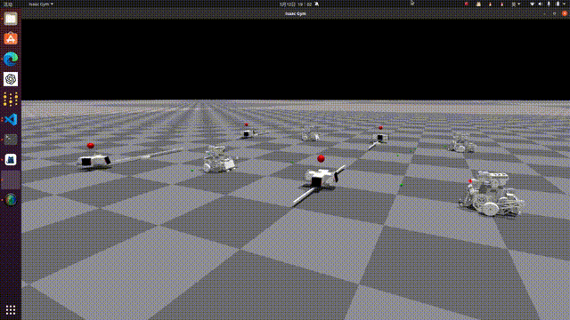
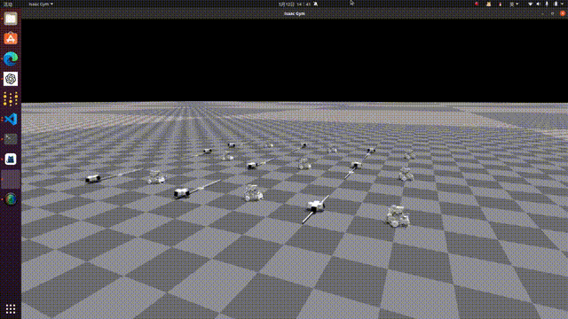
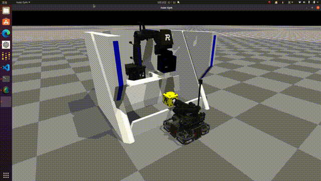
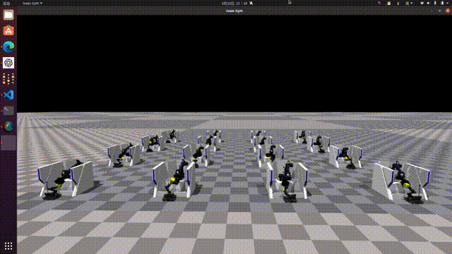

# RoboMasterGym

RoboMaster IsaacGym Framework

> 本项目目前只是调试完成部分项目与IsaacGym的相关接口、资产配置和规则设置，暂时并没有引入强化学习框架和相关算法（后续考虑引入LeeggedGym等框架）
## TODO

- [x] 自瞄小陀螺
- [x] 工程自动兑矿
- [ ] 自动打符
- [ ] 轮腿训练
- [ ] 哨兵导航
- [ ] 战术推演

## AutoAim
| 静态截图 | 内录第一视角 |
|----------|--------------|
|  |  |
|  |  |

## Exchange
| 内录第一视角 | 第三方视角 |
|----------|------------|
|  |  |
|  |  |

## 开源引用
>[RM2024-工程机器人机械结构开源上海交通大学-云汉交龙战队](https://bbs.robomaster.com/article/54080?source=4)